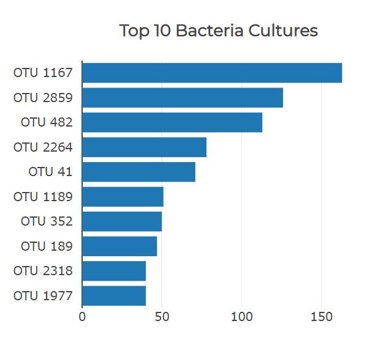
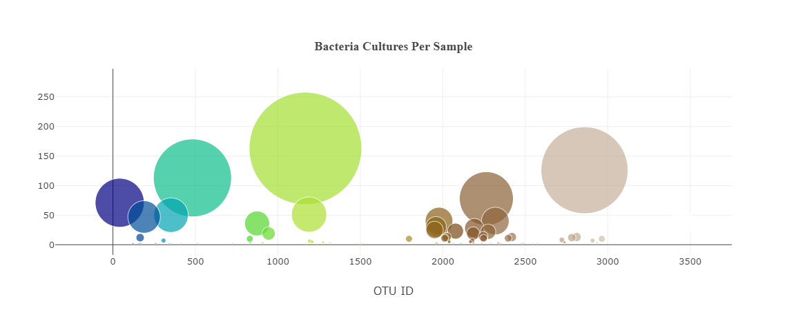
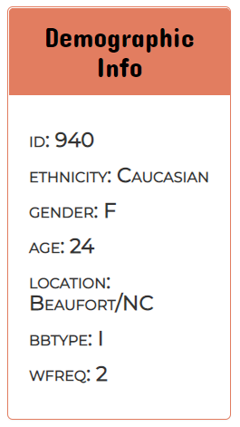
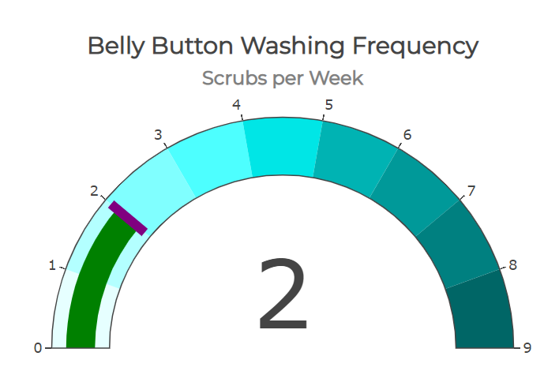
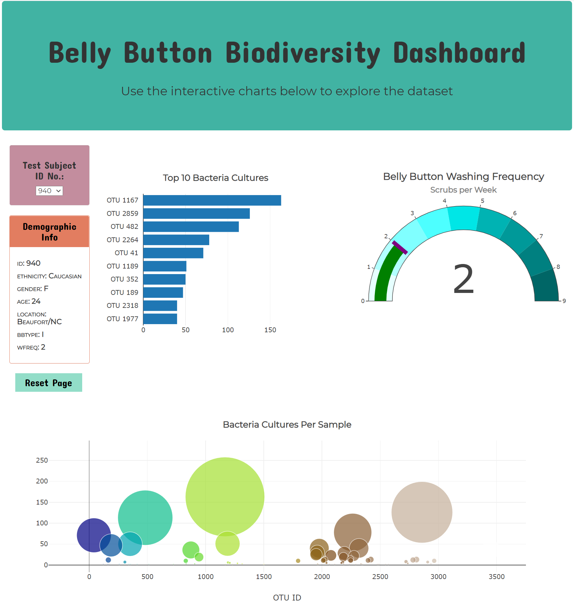

# Plot.ly-challenge - Belly Button Biodiversity

An interactive dashboard was built to explore the [Belly Button Biodiversity dataset](http://robdunnlab.com/projects/belly-button-biodiversity/), which catalogs the microbes that colonize human navels.

The dataset reveals that a small handful of microbial species (also called operational taxonomic units, or OTUs, in the study) were present in more than 70% of people, while the rest were relatively rare.

## Step 1: Plotly
The D3 library was used to read in the json data.  A test subject dropdown was created so you can select among the test subject ID numbers.  All plots are updated any time a new sample is selected.

---

1.  A horizontal bar chart displays the top 10 OTUs found in that individual.  
    * Sample values are used as the values
    * OTU ids are used as the labels
    * OTU labels are used as the hover text

---

2. A bubble chart displays each sample for that individual.
    * OTU ids are used for the x values
    * Sample values are used for the y values
    * Sample values are used for the marker size
    * OTU ids are used for the marker colors
    * OTU labels are used for the text/hover values

---

3. The individual's demographic information (sample metadata) is displayed as available.  Each key, value pair is set forth on the dashboard.

---

## Advanced Challenge Assignment

4.  A gauge chart displays the weekly washing frequency of the individual.  The chart is updated whenever a new sample is selected.
    * Value range from 0 - 9

---

---

### **Click this link to visit the Interactive Dashboard:** [http://RobinWaves.github.io/plotly-challenge](http://RobinWave.github.io/plotly-challenge)

- - -

#### References

Hulcr, J. et al.(2012) _A Jungle in There: Bacteria in Belly Buttons are Highly Diverse, but Predictable_. Retrieved from: [http://robdunnlab.com/projects/belly-button-biodiversity/results-and-data/](http://robdunnlab.com/projects/belly-button-biodiversity/results-and-data/)

- - -